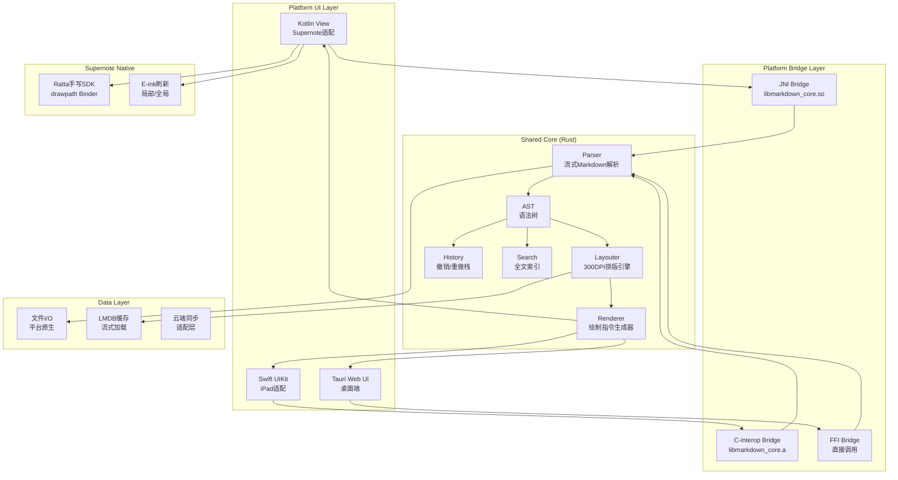
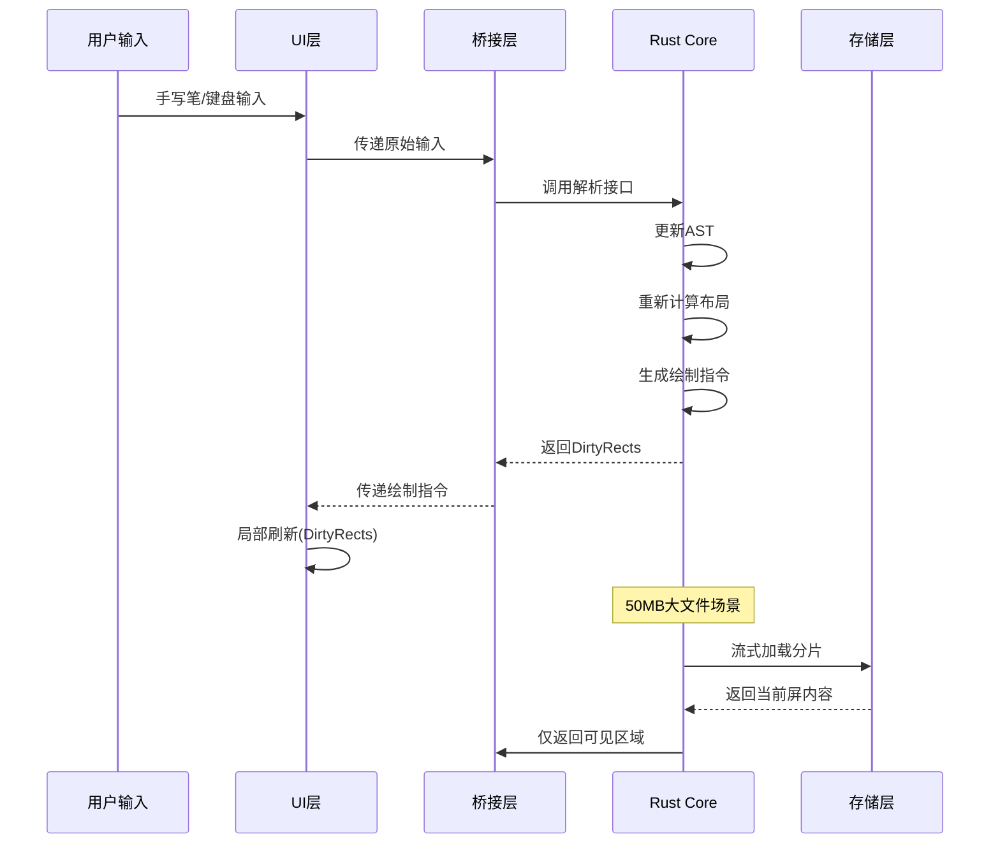

# 跨平台 Markdown 编辑器架构设计书

> **版本**: 2.0
> **日期**: 2026-06-30
> **目标设备**: Supernote A6 X2 Nomad (主) | Windows/macOS/Linux/iOS/Android (次)

---

## 目录

1. [技术选型总览与论证](#1-技术选型总览与论证)
2. [系统架构图](#2-系统架构图)
3. [核心模块设计](#3-核心模块设计)
4. [Supernote专项优化方案](#4-supernote专项优化方案)
5. [PC端与移动端适配](#5-pc端与移动端适配)
6. [源码目录结构](#6-源码目录结构)

---

## 1. 技术选型总览与论证

### 1.1 架构模式决策

#### **选择: A) Shared Core + Native UI**

**核心决策理由**：

| 对比维度 | Shared Core + Native UI | Full Cross-Platform Framework |
|---------|------------------------|------------------------------|
| **渲染性能** | ✅ 原生Canvas，最优性能 | ⚠️ 框架抽象层开销 |
| **内存占用** | ✅ Core层Rust/C++无GC | ⚠️ 框架运行时额外内存 |
| **E-ink适配** | ✅ 可直接控制刷新策略 | ❌ 框架不支持局部刷新 |
| **手写笔集成** | ✅ 直接调用Ratta SDK | ⚠️ 需桥接层 |
| **UI一致性** | ✅ Core保证渲染一致 | ✅ 框架天然一致 |
| **开发效率** | ⚠️ 需维护多套UI | ✅ 单一代码库 |

**结论**: 对于 **300DPI + 4GB RAM** 的Supernote，性能和内存是首要考量，**Shared Core方案是唯一合理选择**。

### 1.2 技术栈矩阵

```
┌─────────────────────────────────────────────────────────────────────────────┐
│                           技 术 栈 矩 阵                                        │
├──────────────┬──────────────────────────────────────────────────────────────┤
│              │                    平 台 分 层                                    │
├──────────────┼──────────────────────────────────────────────────────────────┤
│   UI 层      │  Android/Supernote: Kotlin + NativeView                      │
│              │  iOS: Swift + UIKit                                           │
│              │  PC (Win/Mac/Linux): Rust + Tauri (Web技术)                   │
├──────────────┼──────────────────────────────────────────────────────────────┤
│   桥接层     │  JNI (Android) / C-interop (iOS) / FFI (Tauri)              │
├──────────────┼──────────────────────────────────────────────────────────────┤
│   Core 层    │  ┌─────────────────────────────────────────────────────┐      │
│   (共享核心)  │  │  Rust Core:                                        │      │
│              │  │  • Parser: Markdown解析 (流式)                       │      │
│              │  │  • AST: 语法树结构                                  │      │
│              │  │  • Layouter: 排版引擎 (300DPI优化)                  │      │
│              │  │  • Renderer: 绘制指令生成                            │      │
│              │  │  • History: 撤销重做栈                               │      │
│              │  │  • Search: 全文搜索                                  │      │
│              │  └─────────────────────────────────────────────────────┘      │
├──────────────┼──────────────────────────────────────────────────────────────┤
│   存储层     │  • 文件I/O: 平台原生API                                       │
│              │  • 缓存: LMDB (嵌入式数据库，支持流式)                         │
│              │  • 同步: 云端存储适配层                                        │
└──────────────┴──────────────────────────────────────────────────────────────┘
```

### 1.3 为什么选择 Rust 作为 Core 层

| 特性 | 对Supernote的意义 |
|-----|------------------|
| **内存安全** | 4GB RAM环境下防止内存泄漏是关键 |
| **无GC停顿** | 避免渲染卡顿，E-ink刷新率低更需要稳定帧率 |
| **零成本抽象** | 高级语法不影响性能，适合复杂AST处理 |
| **跨平台编译** | 一套代码编译到 Android/iOS/PC/WebAssembly |
| **并发安全** | 编译期保证，避免手写笔与编辑冲突 |
| **FFI友好** | C ABI兼容，易于与Kotlin/Swift集成 |

### 1.4 UI层选型详情

#### Android/Supernote: Kotlin + NativeView

```kotlin
// 核心: 继承View，直接接收Rust Core的绘制指令
class MarkdownEditorView(context: Context) : View(context) {
    private external fun renderNative(nativeHandle: Long, canvasPtr: Long): Int
    
    // 绕过Android View系统开销，直接操作Canvas
    // 支持局部刷新 (invalidate(Rect))
}
```

**优势**：
- 原生View系统，无框架开销
- 可精确控制 `invalidate(Rect)` 实现局部刷新
- 方便集成Ratta手写SDK（Binder IPC）

#### PC端: Rust + Tauri

```rust
// Tauri Backend (Rust)
#[tauri::command]
fn render_markdown(content: String) -> Vec<RenderCommand> {
    // 直接调用Core，无跨语言开销
    core::render(&content)
}

// Frontend (Web标准)
// 使用WebGL/Canvas2D渲染，保证性能
```

**优势**：
- 前后端同语言（Rust），无FFI开销
- Web标准UI，跨桌面平台一致性
- 打包体积小（~10MB vs Electron ~100MB）

---

## 2. 系统架构图



### 2.1 数据流图



---

## 3. 核心模块设计

### 3.1 Shared Core (Rust) 详细设计

#### 3.1.1 核心数据结构

```rust
/// 文档AST根节点
#[repr(C)]
pub struct MarkdownDocument {
    /// 根节点
    pub root: BlockNode,
    /// 全局元数据
    pub metadata: DocumentMetadata,
    /// 字符编码
    pub encoding: Encoding,
}

/// 块级节点 (对应段落、标题等)
#[repr(C)]
pub enum BlockNode {
    /// 标题 (level 1-6)
    Heading { level: u8, children: Vec<InlineNode> },
    /// 段落
    Paragraph { children: Vec<InlineNode> },
    /// 代码块
    CodeBlock { language: Option<String>, content: String },
    /// 引用块
    BlockQuote { children: Vec<BlockNode> },
    /// 列表
    List { ordered: bool, items: Vec<ListItem> },
    /// 表格
    Table { headers: Vec<InlineNode>, rows: Vec<Vec<InlineNode>> },
    /// 分隔线
    ThematicBreak,
}

/// 内联节点 (对应粗体、斜体等)
#[repr(C)]
pub enum InlineNode {
    Text(String),
    Bold(Box<InlineNode>),
    Italic(Box<InlineNode>),
    Code(String),
    Link { text: String, url: String },
    Image { alt: String, url: String },
    Strikethrough(Box<InlineNode>),
}

/// 文档元数据
#[repr(C)]
pub struct DocumentMetadata {
    /// 总字符数 (用于流式加载进度)
    pub total_chars: usize,
    /// 标题层级结构 (用于目录生成)
    pub toc: Vec<TocEntry>,
    /// 最后修改位置 (用于增量解析)
    pub last_modified_offset: usize,
}

/// 目录条目
#[repr(C)]
pub struct TocEntry {
    pub level: u8,
    pub title: String,
    pub byte_offset: usize,  // 原文中的位置
    pub line_number: usize,
}
```

#### 3.1.2 流式解析接口

```rust
/// 流式解析器 (适配>50MB大文件)
pub struct StreamingParser {
    /// 缓冲区 (最大8MB，防止OOM)
    buffer: RingBuffer<u8, 8388608>,
    /// 当前解析位置
    position: usize,
    /// 文件句柄
    file: MmappedFile,
}

impl StreamingParser {
    /// 创建新的流式解析器
    pub fn new(file_path: &str) -> Result<Self>;
    
    /// 解析指定行范围 (用于按需加载)
    pub fn parse_range(&mut self, start_line: usize, count: usize) 
        -> Result<Vec<BlockNode>>;
    
    /// 增量解析 (从上次位置继续)
    pub fn parse_incremental(&mut self) -> Result<Vec<BlockNode>>;
    
    /// 释放已解析内容 (节省内存)
    pub fn release_before(&mut self, line: usize);
}
```

**内存管理策略**：
- 单次最大加载: **10个屏幕高度** (~2000行)
- AST节点上限: **100,000节点** (约10MB内存)
- 超过上限: 自动释放最旧节点

#### 3.1.3 排版引擎 (300DPI优化)

```rust
/// 排版引擎核心
pub struct Layouter {
    /// 设备DPI (Supernote: 300)
    dpi: f32,
    /// 屏幕尺寸
    screen_size: Size,
    /// 字体度量缓存
    font_metrics_cache: LruCache<FontKey, FontMetrics>,
    /// 字形缓存
    glyph_cache: LruCache<GlyphKey, GlyphBitmap>,
}

impl Layouter {
    /// 为300DPI设备初始化
    pub fn for_supernote() -> Self {
        Self {
            dpi: 300.0,
            screen_size: Size { width: 1404, height: 1872 },
            font_metrics_cache: LruCache::new(1024),
            glyph_cache: LruCache::new(4096),
        }
    }
    
    /// 计算单个块的布局 (返回绝对坐标)
    pub fn layout_block(&mut self, node: &BlockNode, offset: usize) 
        -> LayoutResult;
    
    /// 仅计算可见区域 (用于按需渲染)
    pub fn layout_visible_range(
        &mut self, 
        start_y: usize, 
        end_y: usize
    ) -> Vec<RenderCommand>;
}

/// 布局结果 (包含精确像素坐标)
#[repr(C)]
pub struct LayoutResult {
    /// 渲染指令列表
    pub commands: Vec<RenderCommand>,
    /// 总高度 (用于滚动计算)
    pub total_height: usize,
    /// 脏矩形 (用于局部刷新)
    pub dirty_rects: Vec<Rect>,
}

/// 渲染指令 (不依赖具体平台)
#[repr(C)]
pub enum RenderCommand {
    /// 绘制文本
    DrawText {
        x: f32, y: f32,
        text: String,
        font: FontSpec,
        size: f32,
        color: Color,
    },
    /// 绘制线条 (用于表格边框、下划线等)
    DrawLine {
        x1: f32, y1: f32,
        x2: f32, y2: f32,
        width: f32,
        color: Color,
    },
    /// 绘制矩形 (用于代码块背景、高亮等)
    FillRect {
        x: f32, y: f32,
        width: f32, height: f32,
        color: Color,
    },
    /// 绘制图片
    DrawImage {
        x: f32, y: f32,
        width: f32, height: f32,
        data: Vec<u8>,
    },
}
```

**300DPI优化要点**：
1. **字形缓存**: 热门字符 (CJK前5000字) 常驻内存
2. **度量预计算**: 常用字号 (12/14/16/18/24pt) 预计算
3. **坐标量化**: 使用`u16`存储像素坐标，节省内存
4. **延迟计算**: 不可见区域暂不计算布局

#### 3.1.4 Android/Supernote桥接层

```rust
// FFI接口定义 (C ABI)

/// 创建文档实例
#[no_mangle]
pub extern "C" fn md_document_create(
    content: *const c_char,
    len: usize
) -> *mut MarkdownDocument;

/// 流式加载分片
#[no_mangle]
pub extern "C" fn md_document_load_range(
    doc: *mut MarkdownDocument,
    start_line: usize,
    count: usize,
    out_commands: *mut *mut RenderCommand,
    out_count: *mut usize
) -> i32;  // 返回0成功，-1失败

/// 获取目录
#[no_mangle]
pub extern "C" fn md_document_get_toc(
    doc: *mut MarkdownDocument,
    out_entries: *mut *mut TocEntry,
    out_count: *mut usize
);

/// 全文搜索
#[no_mangle]
pub extern "C" fn md_document_search(
    doc: *mut MarkdownDocument,
    query: *const c_char,
    out_results: *mut *mut SearchResult,
    out_count: *mut usize
);

/// 释放内存
#[no_mangle]
pub extern "C" fn md_free(ptr: *mut c_void);

/// 撤销/重做
#[no_mangle]
pub extern "C" fn md_document_undo(doc: *mut MarkdownDocument) -> i32;
#[no_mangle]
pub extern "C" fn md_document_redo(doc: *mut MarkdownDocument) -> i32;
```

#### 3.1.5 Kotlin桥接实现

```kotlin
// MarkdownCore.kt

object MarkdownCore {
    init {
        System.loadLibrary("markdown_core")
    }
    
    // 文档句柄 (原生指针)
    class DocumentHandle(private val ptr: Long) {
        external fun nativeRelease()
    }
    
    // 创建文档
    external fun nativeCreate(content: String): Long
    
    // 加载可见范围
    external fun nativeLoadRange(
        handle: Long,
        startLine: Int,
        count: Int
    ): NativeRenderResult
    
    // 渲染到Canvas
    external fun nativeRenderToCanvas(
        handle: Long,
        canvasPtr: Long,
        commands: NativeRenderCommands
    ): IntArray  // 返回DirtyRects [x,y,w,h, x,y,w,h, ...]
    
    // 目录
    external fun nativeGetToc(handle: Long): Array<TocEntry>
    
    // 搜索
    external fun nativeSearch(
        handle: Long,
        query: String
    ): Array<SearchResult>
    
    // 撤销/重做
    external fun nativeUndo(handle: Long): Boolean
    external fun nativeRedo(handle: Long): Boolean
}

// 数据结构映射
data class TocEntry(
    val level: Int,
    val title: String,
    val byteOffset: Int,
    val lineNumber: Int
)

data class SearchResult(
    val line: Int,
    val startColumn: Int,
    val endColumn: Int,
    val context: String
)
```

---

## 4. Supernote专项优化方案

### 4.1 高DPI处理策略

#### 4.1.1 字形缓存系统

```rust
/// 三级字形缓存架构
pub struct GlyphCacheSystem {
    /// L1: RAM缓存 (热数据，~2MB)
    l1_ram: LruCache<GlyphKey, GlyphBitmap>,
    
    /// L2: 文件映射缓存 (温数据，~20MB)
    l2_mmap: MmappedGlyphCache,
    
    /// L3: 按需生成 (冷数据)
    l3_freetype: FreetypeRasterizer,
}

impl GlyphCacheSystem {
    /// 获取字形 (自动缓存)
    pub fn get_glyph(&mut self, key: &GlyphKey) -> Option<&GlyphBitmap> {
        // L1命中
        if let Some(glyph) = self.l1_ram.get_mut(key) {
            return Some(glyph);
        }
        
        // L2命中，提升到L1
        if let Some(glyph) = self.l2_mmap.get(key) {
            self.l1_ram.put(key.clone(), glyph.clone());
            return Some(glyph);
        }
        
        // L3生成，写入L1和L2
        if let Some(glyph) = self.l3_freetype.rasterize(key) {
            self.l1_ram.put(key.clone(), glyph.clone());
            self.l2_mmap.put(key, glyph.clone());
            return Some(glyph);
        }
        
        None
    }
    
    /// 预加载CJK常用字 (启动时调用)
    pub fn preload_cjk_common(&mut self) {
        const CJK_TOP_500: &[char] = &['一', '二', '三', /* ... */];
        for &c in CJK_TOP_500 {
            for size in [12, 14, 16, 18, 24] {
                let key = GlyphKey::new(c, size);
                self.get_glyph(&key);
            }
        }
    }
}
```

**内存预算分配**:
```
总可用内存: 4GB
├─ 系统预留: 1GB
├─ 应用框架: 1GB
├─ MarkdownCore: 500MB
│  ├─ AST节点: 100MB (最大10万节点)
│  ├─ 字形缓存L1: 200MB
│  ├─ 排版缓存: 100MB
│  └─ 搜索索引: 100MB
└─ 文件缓冲: 1.5GB
```

#### 4.1.2 坐标系统优化

```rust
/// 使用量化坐标减少内存占用
#[repr(C)]
pub struct QuantizedRect {
    /// 使用u16存储像素坐标 (最大65535，足够1404/1872)
    pub x: u16,
    pub y: u16,
    pub width: u16,
    pub height: u16,
}

impl QuantizedRect {
    /// 从浮点坐标转换
    pub fn from_float(x: f32, y: f32, w: f32, h: f32) -> Self {
        Self {
            x: x.round() as u16,
            y: y.round() as u16,
            width: w.round() as u16,
            height: h.round() as u16,
        }
    }
}
```

### 4.2 局部刷新机制

```kotlin
/**
 * Supernote刷新控制器
 */
class EinkRefreshController(private val view: MarkdownEditorView) {
    
    // 脏矩形合并策略
    private val dirtyRects = mutableListOf<Rect>()
    
    // 最后刷新时间 (防止刷新过频)
    private var lastRefreshTime = 0L
    
    // 最小刷新间隔 (ms)
    private val minRefreshInterval = 50L
    
    /**
     * 添加脏矩形
     */
    fun addDirty(rect: Rect) {
        dirtyRects.add(rect)
        
        // 合并相交矩形
        mergeOverlappingRects()
        
        // 延迟刷新 (50ms内多次修改合并刷新)
        scheduleRefresh()
    }
    
    /**
     * 合并相交矩形 (减少刷新次数)
     */
    private fun mergeOverlappingRects() {
        var merged = true
        while (merged && dirtyRects.size > 1) {
            merged = false
            for (i in 0 until dirtyRects.size - 1) {
                for (j in i + 1 until dirtyRects.size) {
                    if (dirtyRects[i].intersect(dirtyRects[j]).isNotEmpty()) {
                        val mergedRect = dirtyRects[i].union(dirtyRects[j])
                        dirtyRects.removeAt(j)
                        dirtyRects.removeAt(i)
                        dirtyRects.add(mergedRect)
                        merged = true
                        break
                    }
                }
                if (merged) break
            }
        }
    }
    
    /**
     * 执行刷新
     */
    private fun scheduleRefresh() {
        val now = System.currentTimeMillis()
        val elapsed = now - lastRefreshTime
        
        if (elapsed >= minRefreshInterval) {
            performRefresh()
        } else {
            handler.postDelayed({
                performRefresh()
            }, minRefreshInterval - elapsed)
        }
    }
    
    /**
     * 执行实际刷新
     */
    private fun performRefresh() {
        if (dirtyRects.isEmpty()) return
        
        // 计算包围盒
        val boundingBox = dirtyRects.reduce { acc, rect -> acc.union(rect) }
        
        // 如果包围盒超过屏幕1/3，使用全局刷新
        if (boundingBox.width() * boundingBox.height() > view.width * view.height / 3) {
            view.invalidate()  // 全局刷新
        } else {
            // 局部刷新每个脏矩形
            for (rect in dirtyRects) {
                view.invalidate(rect)
            }
        }
        
        dirtyRects.clear()
        lastRefreshTime = System.currentTimeMillis()
    }
    
    /**
     * 判断是否需要全局刷新
     */
    fun needsGlobalRefresh(): Boolean {
        // 分屏切换时需要全局刷新
        // 预览/编辑切换时需要全局刷新
        return view.isSplitScreenMode || view.isPreviewModeChanged
    }
}
```

### 4.3 手写笔集成

```kotlin
/**
 * 手写笔输入处理器 (集成Ratta SDK)
 */
class PenInputHandler(
    private val editorView: MarkdownEditorView,
    private val refreshController: EinkRefreshController
) {
    
    // Ratta SDK接口
    private val drawPathService = RattaDrawPathService()
    
    // 不可写区域 (工具栏等)
    private val disableAreas = mutableListOf<Rect>()
    
    /**
     * 初始化手写服务
     */
    fun init() {
        // 注册不可写区域 (物理像素)
        val toolbarHeight = 80.dp.toPx()
        val physicalWidth = getPhysicalScreenWidth()
        disableAreas.add(Rect(0, 0, physicalWidth, toolbarHeight))
        
        drawPathService.sendDisableAreaInfo(disableAreas)
        drawPathService.sendWritable(true)
    }
    
    /**
     * 处理手写识别结果
     */
    fun onRecognitionResult(result: RecognResultData) {
        val bbox = result.boundingBox
        val keyPoint = result.keyPoint
        
        // 坐标空间修正 (§4 SKILL.md)
        val correctedRect = if (needsCoordinateCorrection(bbox, keyPoint)) {
            correctCoordinateSpace(bbox, keyPoint)
        } else {
            bbox
        }
        
        // 转换为文档坐标
        val (line, column) = editorView.coordinateToOffset(
            correctedRect.centerX(),
            correctedRect.centerY()
        )
        
        // 根据手势类型执行操作
        when (result.gestureType) {
            GestureType.DELETE -> {
                editorView.deleteLine(line)
                triggerPartialRefresh(line)
            }
            GestureType.INSERT -> {
                editorView.insertAtLine(line, result.text)
                triggerPartialRefresh(line)
            }
            GestureType.SELECT -> {
                editorView.selectRange(correctedRect)
            }
        }
    }
    
    /**
     * 坐标空间修正 (A6X2兼容性)
     */
    private fun needsCoordinateCorrection(bbox: Rect, keyPoint: Point): Boolean {
        val bboxMidX = (bbox.left + bbox.right) / 2f
        val bboxMidY = (bbox.top + bbox.bottom) / 2f
        
        return Math.abs(bboxMidX - keyPoint.x) > 20 ||
               Math.abs(bboxMidY - keyPoint.y) > 20
    }
    
    private fun correctCoordinateSpace(bbox: Rect, keyPoint: Point): Rect {
        val scaleX = bbox.centerX().toFloat() / keyPoint.x
        val scaleY = bbox.centerY().toFloat() / keyPoint.y
        
        return Rect(
            (bbox.left / scaleX).toInt(),
            (bbox.top / scaleY).toInt(),
            (bbox.right / scaleX).toInt(),
            (bbox.bottom / scaleY).toInt()
        )
    }
    
    /**
     * 触发局部刷新
     */
    private fun triggerPartialRefresh(line: Int) {
        val rect = editorView.getLineBoundingRect(line)
        refreshController.addDirty(rect)
    }
}
```

### 4.4 内存监控与自动清理

```rust
/// 内存监控器
pub struct MemoryMonitor {
    /// 内存使用上限 (300MB)
    max_memory: usize,
    /// 当前使用量
    current_usage: AtomicUsize,
    /// 警告阈值 (80%)
    warning_threshold: f32,
}

impl MemoryMonitor {
    pub fn new() -> Self {
        Self {
            max_memory: 300 * 1024 * 1024,  // 300MB
            current_usage: AtomicUsize::new(0),
            warning_threshold: 0.8,
        }
    }
    
    /// 检查是否需要清理
    pub fn should_cleanup(&self) -> bool {
        let usage = self.current_usage.load(Ordering::Relaxed);
        usage as f32 / self.max_memory as f32 > self.warning_threshold
    }
    
    /// 触发清理 (释放最旧节点)
    pub fn trigger_cleanup(&self, document: &mut MarkdownDocument) {
        let target = self.max_memory / 2;  // 降至50%
        while self.current_usage.load(Ordering::Relaxed) > target {
            if !document.release_oldest_block() {
                break;
            }
        }
    }
}
```

---

## 5. PC端与移动端适配

### 5.1 PC端架构 (Tauri)

```rust
// src-tauri/src/main.rs

#[tauri::command]
async fn open_file(path: String) -> Result<DocumentHandle, String> {
    Core::instance().open_document(&path)
        .map_err(|e| e.to_string())
}

#[tauri::command]
async fn render_document(
    handle: u64,
    viewport: Viewport
) -> Vec<RenderCommand> {
    Core::instance().render(handle, viewport)
}

#[tauri::command]
async fn search_document(
    handle: u64,
    query: String
) -> Vec<SearchResult> {
    Core::instance().search(handle, &query)
}

fn main() {
    tauri::Builder::default()
        .invoke_handler(tauri::generate_handler![
            open_file,
            render_document,
            search_document,
            save_document,
            undo,
            redo
        ])
        .run(tauri::generate_context!())
        .expect("error while running tauri application");
}
```

```typescript
// src/Editor.tsx (React前端)

interface EditorProps {
  documentPath: string;
}

export const Editor: React.FC<EditorProps> = ({ documentPath }) => {
  const canvasRef = useRef<HTMLCanvasElement>(null);
  const [commands, setCommands] = useState<RenderCommand[]>([]);
  
  useEffect(() => {
    // 加载文档
    invoke<DocumentHandle>('open_file', { path: documentPath })
      .then(handle => {
        // 渲染可见区域
        invoke<RenderCommand[]>('render_document', {
          handle: handle.id,
          viewport: getViewport()
        }).then(cmds => {
          renderCommands(cmds, canvasRef.current);
        });
      });
  }, [documentPath]);
  
  const renderCommands = (cmds: RenderCommand[], canvas: HTMLCanvasElement) => {
    const ctx = canvas.getContext('2d')!;
    
    for (const cmd of cmds) {
      switch (cmd.type) {
        case 'DrawText':
          ctx.fillStyle = cmd.color;
          ctx.font = `${cmd.size}px ${cmd.font}`;
          ctx.fillText(cmd.text, cmd.x, cmd.y);
          break;
        case 'FillRect':
          ctx.fillStyle = cmd.color;
          ctx.fillRect(cmd.x, cmd.y, cmd.width, cmd.height);
          break;
        // ...
      }
    }
  };
  
  return <canvas ref={canvasRef} width={1200} height={800} />;
};
```

### 5.2 iOS端适配 (Swift + Rust Core)

```swift
// MarkdownCore.swift (Swift桥接)

import Foundation

class MarkdownCore {
    private var handle: UnsafeMutableRawPointer?
    
    func load(content: String) -> Bool {
        handle = md_document_create(content, content.count)
        return handle != nil
    }
    
    func renderVisibleRange(startLine: Int, count: Int) -> [RenderCommand] {
        var commands: UnsafeMutablePointer<RenderCommand>?
        var count: Int = 0
        
        md_document_load_range(handle, startLine, count, &commands, &count)
        
        var result: [RenderCommand] = []
        for i in 0..<count {
            result.append(commands![i])
        }
        
        md_free(commands)
        return result
    }
    
    deinit {
        if let handle = handle {
            md_free(handle)
        }
    }
}

// MarkdownView.swift (UIKit)

class MarkdownView: UIView {
    private let core = MarkdownCore()
    private let refreshController = EinkRefreshController()  // iOS不需要
    
    override func draw(_ rect: CGRect) {
        guard let context = UIGraphicsGetCurrentContext() else { return }
        
        let commands = core.renderVisibleRange(
            startLine: visibleLineRange.lowerBound,
            count: visibleLineRange.count
        )
        
        for cmd in commands {
            switch cmd.type {
            case .DrawText:
                context.setTextDrawingMode(.fill)
                cmd.text.draw(at: CGPoint(x: cmd.x, y: cmd.y), withAttributes: [
                    .font: UIFont.systemFont(ofSize: CGFloat(cmd.size)),
                    .foregroundColor: cmd.color
                ])
            case .FillRect:
                cmd.color.setFill()
                context.fill(CGRect(x: cmd.x, y: cmd.y, 
                                   width: cmd.width, height: cmd.height))
            }
        }
    }
}
```

### 5.3 秒开大文档策略

```
┌─────────────────────────────────────────────────────────────────┐
│                     秒开大文档流程                                │
├─────────────────────────────────────────────────────────────────┤
│ 1. 打开文件 (0ms)                                                 │
│    └─ 仅映射文件，不加载内容                                     │
│                                                                 │
│ 2. 解析结构 (50-100ms)                                           │
│    ├─ 扫描标题生成目录 (快速跳转)                                 │
│    └─ 建立行号索引 (用于定位)                                    │
│                                                                 │
│ 3. 渲染首屏 (50-100ms)                                          │
│    ├─ 仅解析首屏内容 (~30行)                                    │
│    ├─ 计算首屏布局                                              │
│    └─ 生成绘制指令                                              │
│                                                                 │
│ 4. 后台预加载 (异步)                                              │
│    ├─ 预解析下一屏内容                                          │
│    ├─ 预加载常用字形                                            │
│    └─ 建立搜索索引                                              │
│                                                                 │
│ 5. 按需加载 (滚动时)                                              │
│    ├─ 检测滚动方向                                              │
│    ├─ 预加载前/后内容                                          │
│    └─ 释放远离内容                                              │
└─────────────────────────────────────────────────────────────────┘
```

```rust
/// 快速打开策略
pub struct FastOpenStrategy {
    /// 行号索引 (用于快速定位)
    line_index: HashMap<usize, ByteOffset>,
    /// 标题索引 (用于目录)
    heading_index: Vec<HeadingEntry>,
}

impl FastOpenStrategy {
    /// 第一阶段: 快速扫描 (50ms)
    pub fn quick_scan(file: &MmappedFile) -> Self {
        let mut result = Self {
            line_index: HashMap::new(),
            heading_index: Vec::new(),
        };
        
        // 扫描每一行，记录位置
        let mut line_num = 0;
        let mut offset = 0;
        
        for line in file.lines() {
            result.line_index.insert(line_num, offset);
            
            // 检测标题
            if let Some(level) = detect_heading_level(&line) {
                result.heading_index.push(HeadingEntry {
                    level,
                    line: line_num,
                    offset,
                    title: extract_heading_title(&line),
                });
            }
            
            line_num += 1;
            offset += line.len() + 1;
        }
        
        result
    }
    
    /// 第二阶段: 按需解析
    pub fn parse_on_demand(&self, range: Range<usize>) -> Vec<BlockNode> {
        // 仅解析请求的行范围
        let mut nodes = Vec::new();
        for line in range {
            if let Some(&offset) = self.line_index.get(&line) {
                nodes.push(parse_line_at(offset));
            }
        }
        nodes
    }
}
```

---

## 6. 源码目录结构

```
markdown-editor/
├── core/                          # Shared Core (Rust)
│   ├── Cargo.toml
│   ├── src/
│   │   ├── lib.rs                # FFI入口
│   │   ├── parser/
│   │   │   ├── mod.rs
│   │   │   ├── streaming.rs      # 流式解析
│   │   │   └── ast.rs            # AST定义
│   │   ├── layout/
│   │   │   ├── mod.rs
│   │   │   ├── engine.rs         # 排版引擎
│   │   │   ├── dpi.rs            # DPI适配
│   │   │   └── cache.rs          # 字形缓存
│   │   ├── render/
│   │   │   ├── mod.rs
│   │   │   ├── commands.rs       # 绘制指令
│   │   │   └── renderer.rs       # 渲染器
│   │   ├── history/
│   │   │   ├── mod.rs
│   │   │   └── stack.rs          # 撤销重做
│   │   ├── search/
│   │   │   ├── mod.rs
│   │   │   └── index.rs         # 全文搜索
│   │   └── bridge/
│   │       ├── mod.rs
│   │       ├── jni.rs            # Android JNI
│   │       ├── c_ffi.rs          # C FFI (iOS)
│   │       └── types.rs          # 共享类型
│   └── ffi/                      # C头文件
│       ├── markdown_core.h
│       └── types.h
│
├── android/                       # Android/Supernote
│   ├── app/
│   │   ├── build.gradle
│   │   ├── src/main/
│   │   │   ├── java/com/editor/
│   │   │   │   ├── MarkdownCore.kt      # Rust桥接
│   │   │   │   ├── MarkdownEditorView.kt  # 自定义View
│   │   │   │   ├── EinkRefreshController.kt  # 刷新控制
│   │   │   │   ├── PenInputHandler.kt   # 手写处理
│   │   │   │   ├── editor/
│   │   │   │   │   ├── EditorActivity.kt
│   │   │   │   │   ├── PreviewMode.kt
│   │   │   │   │   ├── SplitScreenMode.kt
│   │   │   │   │   └── RevisionMode.kt
│   │   │   │   ├── ui/
│   │   │   │   │   ├── toolbar/
│   │   │   │   │   ├── quickbar/
│   │   │   │   │   ├── toc/
│   │   │   │   │   └── search/
│   │   │   │   └── utils/
│   │   │   │       ├── CoordinateUtils.kt
│   │   │   │       └── FileUtils.kt
│   │   │   ├── jniLibs/
│   │   │   │   ├── arm64-v8a/
│   │   │   │   │   └── libmarkdown_core.so
│   │   │   │   └── armeabi-v7a/
│   │   │   │       └── libmarkdown_core.so
│   │   │   └── res/
│   │   │       ├── drawable/      # 灰度图标
│   │   │       ├── layout/
│   │   │       └── values/
│   │   └── keystore.properties    # 本地密钥 (不入库)
│   └── ratta.jks                   # 厂商密钥 (不入库)
│
├── ios/                           # iOS
│   ├── MarkdownEditor/
│   │   ├── MarkdownCore.swift     # Rust桥接
│   │   ├── MarkdownView.swift     # 自定义View
│   │   ├── EditorViewController.swift
│   │   └── Info.plist
│   └── Frameworks/
│       └── libmarkdown_core.a     # Rust静态库
│
├── desktop/                       # Tauri (PC)
│   ├── src-tauri/
│   │   ├── Cargo.toml
│   │   ├── src/
│   │   │   └── main.rs            # Tauri后端
│   │   └── tauri.conf.json
│   └── src/
│       ├── App.tsx
│       ├── Editor.tsx
│       ├── Preview.tsx
│       └── components/
│
├── common/                        # 跨平台共享资源
│   ├── fonts/                     # 字体文件
│   │   ├── NotoSansCJK-Regular.ttf
│   │   └── JetBrainsMono-Regular.ttf
│   ├── icons/                     # 图标 (SVG源文件)
│   └── themes/                    # 主题配置
│
├── docs/                          # 文档
│   ├── 架构设计.md
│   ├── API文档.md
│   └── Supernote集成指南.md
│
├── build/                         # 构建脚本
│   ├── build-core.sh              # 构建Rust Core
│   ├── build-android.sh
│   ├── build-ios.sh
│   └── build-desktop.sh
│
├── tests/                         # 测试
│   ├── core_tests/
│   ├── integration_tests/
│   └── supernote_tests/
│
└── README.md
```

### 6.1 关键构建配置

#### `core/Cargo.toml`

```toml
[package]
name = "markdown_core"
version = "0.1.0"
edition = "2021"

[lib]
crate-type = ["cdylib", "staticlib"]  # 支持动态/静态链接

[dependencies]
# 解析
pulldown-cmark = "0.9"
# 字形处理
rustybuzz = "0.7"
font-types = "0.1"
# 缓存
lru = "0.11"
# 并发
rayon = "1.7"
# 搜索
tantivy = "0.19"

[profile.release]
opt-level = 3        # 最高优化
lto = true           # 链接时优化
codegen-units = 1     # 单编译单元 (更优化)
strip = true         # 剥离符号
```

#### `android/app/build.gradle`

```groovy
android {
    defaultConfig {
        ndk {
            abiFilters 'arm64-v8a', 'armeabi-v7a'
        }
    }
    
    signingConfigs {
        // 使用keystore.properties (不入库)
        def props = new Properties()
        def propsFile = rootProject.file("keystore.properties")
        if (propsFile.exists()) {
            props.load(new FileInputStream(propsFile))
        }
        
        release {
            storeFile file("ratta.jks")
            storePassword props.getProperty("storePassword")
            keyAlias props.getProperty("keyAlias", "ratta")
            keyPassword props.getProperty("keyPassword")
        }
        debug {
            storeFile file("ratta.jks")
            storePassword props.getProperty("storePassword")
            keyAlias props.getProperty("keyAlias", "ratta")
            keyPassword props.getProperty("keyPassword")
        }
    }
    
    buildTypes {
        release { signingConfig signingConfigs.release }
        debug { signingConfig signingConfigs.debug }
    }
}

dependencies {
    implementation project(':core')  // Rust Core
}
```

---

## 附录

### A. 性能指标

| 场景 | 目标性能 |
|-----|---------|
| 50MB文件打开 | <200ms |
| 单屏渲染 | <50ms |
| 手写笔响应 | <16ms (60fps) |
| 局部刷新延迟 | <50ms |
| 搜索100k字 | <100ms |
| 撤销/重做 | <10ms |

### B. 内存预算 (4GB设备)

```
总内存: 4096MB
├─ 系统保留: 1024MB (25%)
├─ 应用框架: 1024MB (25%)
├─ MarkdownCore: 500MB (12%)
│  ├─ AST: 100MB
│  ├─ 字形缓存: 200MB
│  ├─ 排版缓存: 100MB
│  └─ 搜索索引: 100MB
└─ 文件缓冲: 1548MB (38%)
```

### C. Supernote刷新模式对照

| 刷新模式 | 使用场景 | 闪烁程度 |
|---------|---------|---------|
| `EPD_FULL` | 全局刷新、首次打开 | 高 |
| `EPD_PARTIAL` | 局部编辑、打字 | 低 |
| `EPD_A2` | 光标移动、进度条 | 极低 |
| `EPD_AUTO` | 系统自动选择 | 自适应 |

---

**文档版本**: 2.0  
**最后更新**: 2026-06-30  
**维护者**: 架构团队
