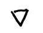

# Markdown编辑器界面交互

## 一、Markdown文档入口

用户在项目中点击  进入创建Markdown文档界面。

---

## 二、Markdown文档创建界面

用户在文本框内输入文件名后点击“确定”创建md文档后进入编辑界面。

---

## 三、外接键盘下的编辑界面

### 1. 顶部工具栏组件功能

这是外接接盘时的竖屏编辑页面，编辑页面底部有外接键盘固定标识，用户在此页通过光标输入基础markdown语法进行编辑。

用户可通过双指滑动滚轮调节页面位置。

### 2. 快捷工具栏位置

用户点击唤出快捷工具栏，位于外接键盘标识上方，再次点击关闭。

---

## 四、软键盘下的编辑界面

### 1. 软键盘位置

这是使用软键盘时的编辑页面，软键盘默认隐藏，用户可点击屏幕空白处唤出软键盘。

### 2. 快捷工具栏位置

用户点击唤出的快捷栏在软键盘上方，再次点击关闭。

---

## 五、预览界面

用户点击  切换到预览模式，图标变为  ，再次点击可关闭预览。

仅在预览模式下点击  开启修订后图标不变，再次点击  关闭修订。

开启预览后，键盘标识隐藏。

预览界面显示渲染后的markdown格式文档。

---

## 六、外接键盘下的分屏界面

### 1. 默认界面

用户外接键盘时点击  开启分屏，图标变为  ，再次点击可关闭分屏。

页面被均分为两个区域，下方为编辑区，上方为预览区。

仅允许在编辑区内进行光标编辑。

外接键盘标识存在页面底部。

### 2. 快捷工具栏位置

用户点击  唤出快捷栏，快捷栏占用编辑区面积，位置在键盘标识上方，再次点击可关闭。

---

## 七、软键盘下的分屏界面

### 1. 默认界面

用户点击   开启分屏，图标变为   ，再次点击可关闭分屏。

页面被分为两个区域，下方为编辑区，上方为预览区，编辑区与预览区比例为4:6。

软键盘标识位于页面底部。

### 2. 快捷工具栏位置

用户点击  唤出快捷工具栏，工具栏占用编辑区面积，再次点击可关闭。

---

## 八、修订功能

### 1. 全屏下修订

用户点击  开启修订，图标变为  ，再次点击可关闭修订。

开启修订后页面内光标消失，键盘标识隐藏。

编辑和预览下都支持修订功能。

### 2. 分屏下修订

用户在分屏下开启修订后，页面内光标消失，键盘标识隐藏。

分屏下的编辑和预览区都支持修订功能。

---

## 九、侧边目录

用户点击顶部工具栏中的  ，展开左侧目录，目录页占屏幕的2/3。

用户点击右侧页面收起目录。

用户可点击  展开标题，图标变为  ，再次点击可折叠标题。

用户单击标题可跳转对应内容，触发条件：单击标题后立即抬起。

用户点击标题后拖拽可进行同级别标题调序，触发条件：点击标题后不抬起拖拽。

开启目录后页面内键盘标识隐藏。

---

## 十、查找和替换

### 1. 查找功能

用户点击  开启搜索框，再次点击可关闭。

用户输入内容后点击  确认搜索后，框选页面全局内第一个指定目标。

### 2. 替换功能

在搜索框中点击  打开替换框，再次点击关闭。

---

## 十一、自定义快捷键组合

用户点击  打开快捷键设置界面，用户可以自定义外接键盘快捷键组合。

---

## 十二、保存

### 1. 手动保存

无编辑状态下  不可点击，用户输入内容后可点击，弹出‘‘正在保存’’弹窗，保存成功后弹窗消失。

每次保存成功后， 就变为不可点击状态，在用户再次编辑内容后可点击。

### 2. 防丢失保护

用户点击  或切换到其他界面前，会弹出提示框，提示用户是否保存修改。

关机开机或重启后再回到此界面也会弹出该提示框，防止文件丢失。

